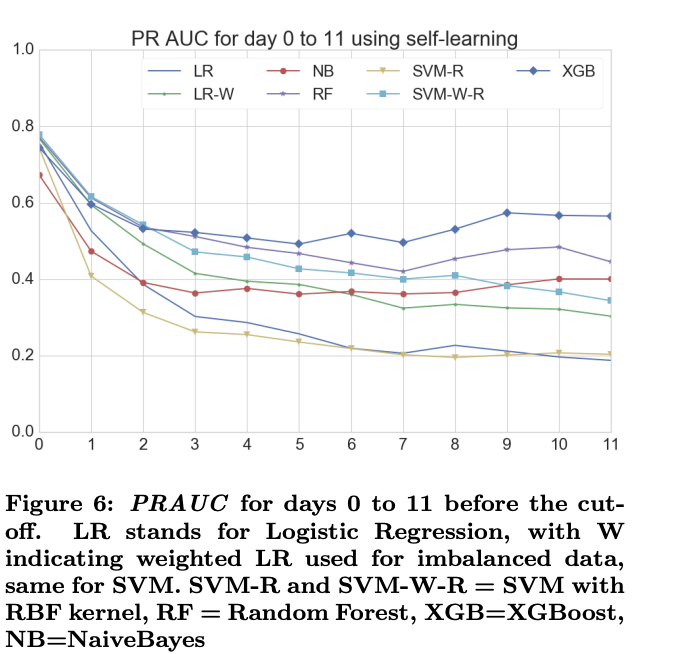
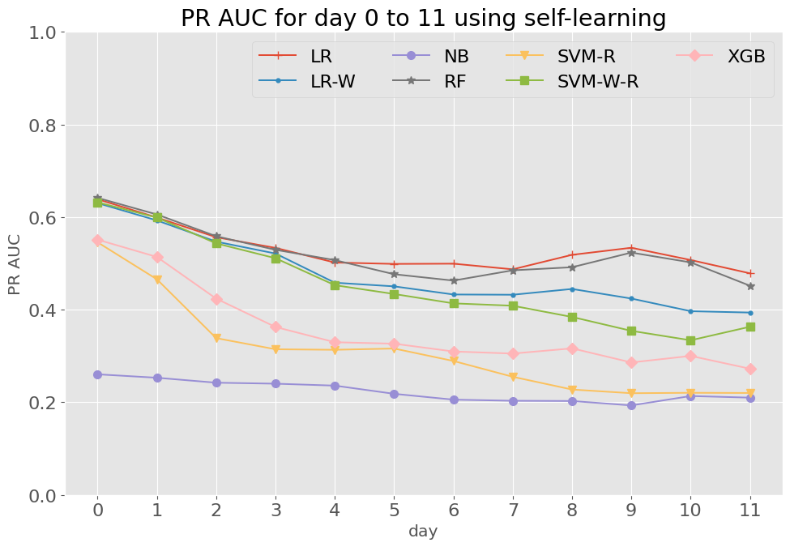
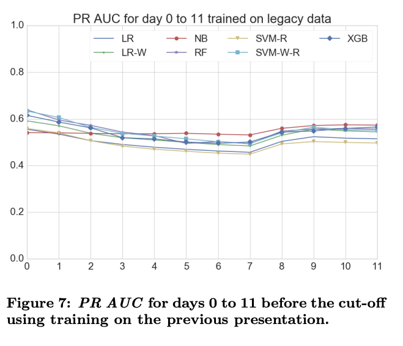
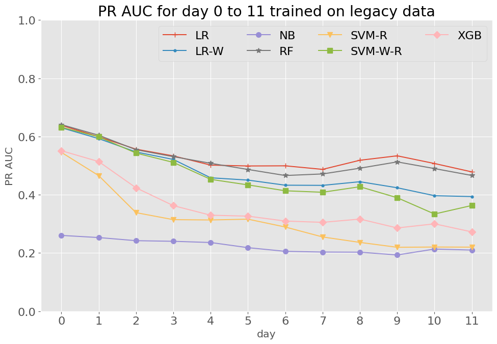

# Ouroboros: Early identification of at-risk students Paper Replication

Reproducing paper: [Ouroboros: Early identification of at-risk students without models based on legacy data](https://oro.open.ac.uk/49731/1/paper.pdf)


## 🚀 Quick Start
0. Environment Setup

   ```
   python3 -m venv venv
   source venv/bin/activate
   pip install -r requirements.txt
   ```
1. Download OULAD CSVs from the dataset page below.
2. Place CSVs into `ouroboros_OULAD_PaperReplicate/selflearner/data_load/data/` with these names:
   - `courses.csv`, `assessments.csv`, `vle.csv`, `studentInfo.csv`, `studentAssessment.csv`, `studentRegistration.csv`, `studentVle.csv`
3. Prepare the datasets, convert CSVs to HDF5:

```
python convert_csv_to_h5.py
```

This creates `selflearner/data_load/data/oulad.h5`

# Experiments

See [notebooks/ouroboros_experiments_new.ipynb](notebooks/ouroboros_experiments_new.ipynb)

Attention:
1. Follow the dataset split rules: splits are time-window based, not random.
2. Be careful with the label definition.
3. Describe the experiment/data section clearly.
4. Report and discuss trends in the results.
5. Feature construction can be slow; add a progress bar if needed.

## Results

### Table 4: PRAUC values for different days trained on the same presentation.

Paper:

| Day | SVM-W-R | SVM-R | LR | LR-W | NB | RF | XGB |
| --- | --- | --- | --- | --- | --- | --- | --- |
| 0 | 0.7790 | 0.7435 | 0.7561 | 0.7682 | 0.6779 | 0.7748 | 0.7442 |
| 1 | 0.6161 | 0.4081 | 0.5267 | 0.5944 | 0.4587 | 0.6184 | 0.5965 |
| 2 | 0.5436 | 0.3138 | 0.3852 | 0.4934 | 0.3673 | 0.5353 | 0.5315 |
| 3 | 0.4726 | 0.2629 | 0.3019 | 0.4164 | 0.3412 | 0.4960 | 0.5225 |
| 4 | 0.4596 | 0.2547 | 0.2866 | 0.3954 | 0.3577 | 0.4796 | 0.5079 |
| 5 | 0.4289 | 0.2363 | 0.2569 | 0.3870 | 0.3453 | 0.4600 | 0.4920 |
| 6 | 0.4171 | 0.2185 | 0.2195 | 0.3610 | 0.3475 | 0.4234 | 0.5200 |
| 7 | 0.4024 | 0.2027 | 0.2072 | 0.3263 | 0.3456 | 0.4309 | 0.4959 |
| 8 | 0.4118 | 0.1948 | 0.2272 | 0.3350 | 0.3487 | 0.4378 | 0.5309 |
| 9 | 0.3850 | 0.2031 | 0.2120 | 0.3260 | 0.3809 | 0.4820 | 0.5737 |
| 10 | 0.3677 | 0.2074 | 0.1967 | 0.3225 | 0.4011 | 0.4785 | 0.5669 |
| 11 | 0.3440 | 0.2033 | 0.1879 | 0.3039 | 0.3985 | 0.4569 | 0.5652 |

Replication:

| Day | SVM-W-R | SVM-R | LR | LR-W | NB | RF | XGB |
| --- | --- | --- | --- | --- | --- | --- | --- |
| 0 | 0.6319 | 0.5457 | 0.6387 | 0.6304 | 0.2605 | 0.6416 | 0.5514 |
| 1 | 0.5991 | 0.4658 | 0.5991 | 0.5929 | 0.2531 | 0.6058 | 0.5141 |
| 2 | 0.5433 | 0.3387 | 0.5567 | 0.5471 | 0.2424 | 0.5588 | 0.4240 |
| 3 | 0.5113 | 0.3146 | 0.5336 | 0.5214 | 0.2403 | 0.5294 | 0.3627 |
| 4 | 0.4530 | 0.3135 | 0.5020 | 0.4584 | 0.2361 | 0.5072 | 0.3298 |
| 5 | 0.4340 | 0.3162 | 0.4990 | 0.4505 | 0.2184 | 0.4767 | 0.3266 |
| 6 | 0.4138 | 0.2893 | 0.4995 | 0.4329 | 0.2058 | 0.4629 | 0.3098 |
| 7 | 0.4087 | 0.2552 | 0.4873 | 0.4324 | 0.2033 | 0.4851 | 0.3053 |
| 8 | 0.3844 | 0.2276 | 0.5186 | 0.4449 | 0.2029 | 0.4918 | 0.3166 |
| 9 | 0.3544 | 0.2197 | 0.5339 | 0.4242 | 0.1933 | 0.5234 | 0.2861 |
| 10 | 0.3340 | 0.2206 | 0.5074 | 0.3969 | 0.2136 | 0.5022 | 0.3002 |
| 11 | 0.3633 | 0.2202 | 0.4786 | 0.3939 | 0.2101 | 0.4518 | 0.2726 |

### Figure 6: PR AUC for day 0 to 11 using Self-learning

- Paper: 
- Replication: 

### Figure 7: PR AUC for day 0 to 11 trained on legacy data

- Paper: 
- Replication: 

### Key Finding

- Overall gap vs paper: replication PRAUC is consistently lower across days and models.
- Strongest replicated baselines: LR and RF are top-performing early (day 0–2), with gradual decline over time; NB is weakest throughout.
- Class weighting: LR-W and SVM-W-R underperform their unweighted counterparts in replication, suggesting the label skew or weighting scheme may not align with feature distributions.
- Trend over time: PRAUC generally decreases as the prediction horizon extends (later days), indicating harder early identification with less information.
- XGB underperformance: XGB trails LR/RF notably; likely sensitive to hyperparameters, feature scaling, or data sparsity in early windows.


## 📊 Dataset Description
- The original paper used HDF5 data, which is no longer available for download. The latest data is provided as CSV at https://analyse.kmi.open.ac.uk/open-dataset. You can use `convert_csv_to_h5.py` to convert CSV to HDF5 if needed.

For more dataset details, see the [dataset](https://analyse.kmi.open.ac.uk/open-dataset).
